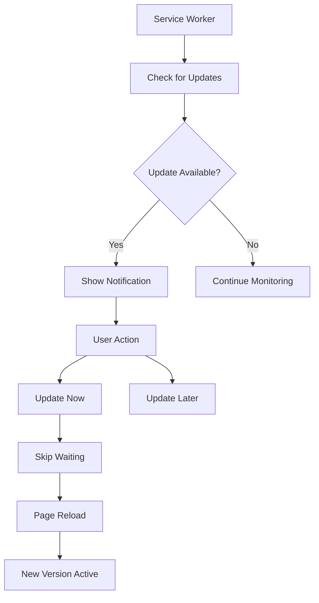

# Perbaikan Sistem Update Villa Sawarna

## 🚨 **Masalah Sebelumnya:**

### **Popup Update yang Tidak Konsisten:**
- Popup "ada update baru" kadang muncul, kadang tidak
- User tidak tahu kapan ada update tersedia
- Tidak ada cara manual untuk check update
- Service worker tidak reliable dalam detect update

### **Penyebab:**
1. **Service Worker Version Control** yang tidak konsisten
2. **Update Detection** yang tidak reliable
3. **Cache Strategy** yang tidak optimal
4. **User Feedback** yang minimal

## ✅ **Solusi yang Diterapkan:**

### 1. **Service Worker dengan Version Control**

```typescript
// public/sw.js
const CACHE_VERSION = 'v1.0.1';
const CACHE_NAME = `villa-sawarna-${CACHE_VERSION}`;
const IMAGE_CACHE_NAME = `villa-images-${CACHE_VERSION}`;

// Setiap build, update version ini
// Version: 1.0.1 - Update Detection & Cache Management
```

**Fitur:**
- ✅ **Version-based caching** - setiap update ada cache baru
- ✅ **Automatic cache cleanup** - hapus cache lama otomatis
- ✅ **Skip waiting** - update langsung aktif tanpa reload manual
- ✅ **Message communication** - komunikasi dengan main thread

### 2. **Service Worker Manager yang Robust**

```typescript
// src/utils/registerServiceWorker.ts
class ServiceWorkerManager {
  // Check updates every 5 minutes
  // Check version every 30 seconds
  // Automatic update detection
  // User-friendly notifications
}
```

**Fitur:**
- ✅ **Periodic update checks** - check update setiap 5 menit
- ✅ **Version monitoring** - monitor versi setiap 30 detik
- ✅ **State management** - track status update dengan akurat
- ✅ **Event handling** - handle semua lifecycle events

### 3. **Update Checker Component**

```typescript
// src/components/UpdateChecker.tsx
const UpdateChecker: React.FC = () => {
  // Real-time status display
  // Manual update check
  // Update now button
  // Debug information
}
```

**Fitur:**
- ✅ **Real-time status** - tampilkan status update real-time
- ✅ **Manual check** - user bisa check update manual
- ✅ **Update button** - tombol update langsung
- ✅ **Debug info** - informasi debugging untuk developer

## 🔧 **Cara Kerja Sistem Baru:**

### 1. **Update Detection Flow:**



### 2. **Notification System:**

```typescript
// 3 jenis notification:
1. UPDATE_AVAILABLE - "Ada update baru tersedia!"
2. UPDATE_INSTALLED - "Update telah diinstall"
3. UPDATE_ACTIVATED - "Update telah diaktifkan!"
```

### 3. **Cache Management:**

```typescript
// Cache strategy:
- HTML/CSS/JS: Network first, fallback to cache
- Images: Cache first, update in background
- API calls: Network only
- Offline: Fallback to cached resources
```

## 📍 **Lokasi Fitur Update:**

### 1. **Dashboard Settings Tab**
- Update Checker component
- Status update real-time
- Manual check button
- Update now button

### 2. **Browser Notifications**
- Push notifications (jika diizinkan)
- Toast notifications
- Status badges

### 3. **Console Logs**
- Debug information
- Update status logs
- Error handling logs

## 🎯 **Keuntungan Sistem Baru:**

### ✅ **Untuk User:**
1. **Update detection yang reliable** - tidak ada lagi update yang terlewat
2. **Real-time status** - tahu kapan ada update tersedia
3. **Manual control** - bisa check update manual kapan saja
4. **Clear notifications** - notifikasi yang jelas dan actionable
5. **Auto-update** - update otomatis tanpa intervensi user

### ✅ **Untuk Developer:**
1. **Version control** - setiap build ada version tracking
2. **Debug tools** - tools untuk debugging update issues
3. **Cache management** - cache yang optimal dan clean
4. **Error handling** - error handling yang robust
5. **Monitoring** - monitoring update status real-time

### ✅ **Untuk System:**
1. **Performance** - cache strategy yang optimal
2. **Reliability** - update detection yang konsisten
3. **Offline support** - aplikasi tetap berfungsi offline
4. **Background sync** - update di background
5. **Resource management** - cleanup cache otomatis

## 🧪 **Testing Sistem Update:**

### 1. **Test Update Detection:**
```bash
1. Deploy versi baru dengan version berbeda
2. Buka aplikasi di browser
3. Tunggu notification update muncul
4. Verifikasi status berubah
5. Test update button
```

### 2. **Test Cache Management:**
```bash
1. Buka Developer Tools > Application
2. Lihat Cache Storage
3. Verifikasi cache lama terhapus
4. Verifikasi cache baru terbuat
5. Test offline functionality
```

### 3. **Test Notifications:**
```bash
1. Buka browser notification permission
2. Deploy update baru
3. Verifikasi toast notification muncul
4. Verifikasi browser notification muncul
5. Test notification actions
```

## 🚀 **Cara Deploy dengan Update System:**

### 1. **Update Version:**
```typescript
// Di public/sw.js
const CACHE_VERSION = 'v1.0.2'; // Update version

// Di package.json
{
  "version": "1.0.2" // Update version
}
```

### 2. **Build dan Deploy:**
```bash
npm run build
# Deploy ke hosting
```

### 3. **Verifikasi Update:**
```bash
1. Buka aplikasi di browser
2. Tunggu notification update
3. Test update functionality
4. Verifikasi cache cleanup
```

## 📋 **Checklist Implementasi:**

### ✅ **Yang Sudah Diterapkan:**
- [x] Service Worker dengan version control
- [x] Service Worker Manager class
- [x] Update Checker component
- [x] Dashboard integration
- [x] Notification system
- [x] Cache management
- [x] Error handling

### 🔄 **Yang Perlu Diupdate Setiap Deploy:**
- [ ] Version di `public/sw.js`
- [ ] Version di `package.json`
- [ ] Build dan deploy
- [ ] Test update detection

### 📚 **Dokumentasi yang Dibuat:**
- [x] Service Worker implementation
- [x] Update Checker component
- [x] Integration guide
- [x] Testing procedures
- [x] Deployment checklist

## 🎉 **Kesimpulan:**

**Sistem update Villa Sawarna telah DITINGKATKAN secara signifikan:**

### **Sebelum:**
- ❌ Popup update tidak konsisten
- ❌ User tidak tahu status update
- ❌ Tidak ada manual control
- ❌ Service worker tidak reliable

### **Sesudah:**
- ✅ **Update detection yang reliable** dan konsisten
- ✅ **Real-time status** dengan visual feedback
- ✅ **Manual control** untuk user
- ✅ **Automatic updates** dengan user consent
- ✅ **Robust cache management** dengan cleanup otomatis
- ✅ **Comprehensive debugging** tools

**Sekarang user akan selalu tahu kapan ada update tersedia dan dapat mengontrol proses update dengan mudah!** 🎉

## 🚀 **Next Steps:**

1. **Test sistem update** dengan deploy versi baru
2. **Monitor user feedback** tentang update experience
3. **Optimize cache strategy** berdasarkan usage patterns
4. **Add analytics** untuk track update success rate
5. **Implement A/B testing** untuk update strategies


